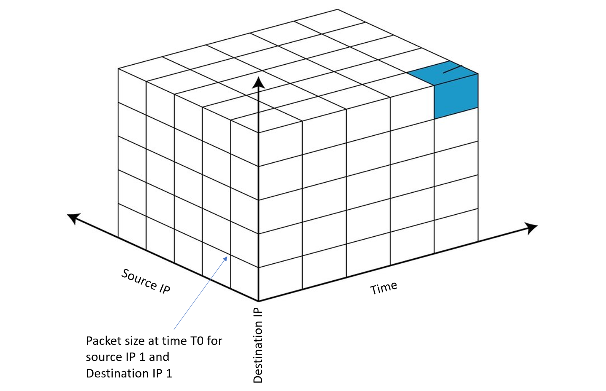

# Traffic matrix prediction for software defined networks

## Introduction

Traffic Matrix clearly describes the volume and the distribution of traffic flows inside a network, the rows and columns are nodes, could be a central node or an edge node.

Each element of the traffic matrix is the outgoing traffic in MB from the row element to the column element at a certain time step, For exp:

The outgoing traffic from Node LAX to NODE NYC is 2389 MBs for the slice in time we have below.

Traffic matrices can play a vital role in improving network management, such as traffic accounting, short-time traffic scheduling or re-routing, network design, and most importantly resource planning and saving cost on unwanted infrastructure. 

Predicting the next steps of the matrice accuratly is essential to handle these tasks.

## Goal

We need to imagine a descrete traffic tensor as a 3D tensor where each 2D slice is a traffic matrix at specific time step. A time step or window sperates two matrices, the time window is actually a parameter that needs to be optimized given a specific case and business need. 

